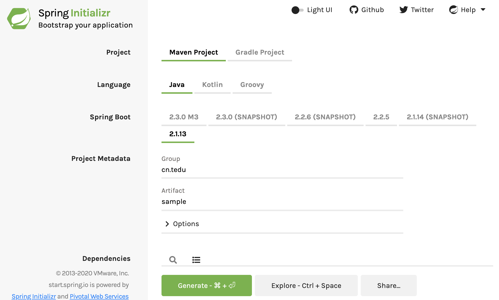

# 1.SpringBoot框架的作用
SpringBoot框架是一个已经完成了绝大部分配置的SpringMVC框架。
还能更简单的整合其他框架一起使用。

SpringBoot框架的核心思想是"约定大于配置":
框架已经完成了相关配置，开发人员只需要按照相关标准使用即可。


# 2.创建SpringBoot项目
创建SpringBoot项目，与创建传统项目并不太相同：
1. 将SpringBoot作为父级项目，直接创建子集的项目；
2. 在开发工具中直接创建:
    - 如果使用的是Eclipse, 需要安装`Spring Tools`插件:
        ```
        Eclipse -> Help -> Eclipse Marketplace:
        search 'SpringBot', choose 'SpringBoot'
        ```
    - 
3. 从[Spring Initializr](https://start.spring.io/)开始项目.
    
    - 点击Genarate, 生成项目, 会自动下载。
    - 文件解压，移动到Eclipse的Workspace.
4. 导入已存在的Maven工程
- Maven: Update Project -> Force update

# 3. 关于SpringBoot的基本检查
创建好的项目中，默认存在`cn.tedu.sample`包。
SpringBoot默认将其作为组件扫描的根包。组件类，必须放在这个包下。

在`src/main/java`下，默认存在`SampleApplication`. 类中存在**main()**方法. Run As Java Application.

SpringBoot内置了Tomcat。


在`src/main/test`下，默认存在`SampleApplicationTests`类，和`contextLoad()`测试方法。 其他单元测试也要放在`src/main/test`路径下。

执行SpringBoot的单元测试时，会加载整个项目的环境，包括加载一些配置文件、加载Spring容器等。

# 4.在项目中添加静态资源
静态资源：客户端可以直接访问的资源，例如`.html`, `.css`, `.js`
`src/main/resources/static`中存放静态资源。

在这个路径中创建`index.html`, 启动项目。

Spring启动日志中存在这么一句话：
```
Tomcat started on port(s): 8080 (http) with context path ''
```
ContextPath默认为`''`，所以在访问资源时，URL中不需要添加项目名称。

在**src/main/resources**下， 默认存在`application.properties`文件。这个文件是自定义配置文件，也可以配置SpringBoot框架约定的属性，注意不要出现拼写错误。

例如，可以在这个配置文件中添加Tomcat的端口号配置。

```
server.port=9999
```

Windows系统下，将端口号改成80, 浏览器中输入`http://localhost`就能访问主页。


# 5. 使用控制器处理请求

在SpringBoot项目中，没有**web.xml**。 在SpringMVC中核心的`DispatcherServlet`是**SpringBoot**通过类中的方法来配资的。 映射的路径是`/*`， 所以对应的@RequestMapping不需要`.do`.
```java
@Controller
public class UserController {
    
    // http://localhost:9999/hello
    @RequestMapping("hello")
    @ResponseBody
    public String hello() {
        return "hello";
    }
}

```


SpringBoot已经将字符编码全部改成了`utf-8`.


`@RestController`天生响应正文。 就不用写`@ResponseBody`了。
```java
@RestController
public class UserController {
    
    // http://localhost:9999/hello
    @RequestMapping("hello")
    public String hello() {
        return "欢迎使用SpringBoot框架处理客户端请求！！";
    }
}
```

`@RequestMapping`分为`@GetMapping`和`@POSTMapping`， 还有`@PutMapping`和`@DeleteMapping`等.


页面： 填写注册信息，提交AJAX请求并处理结果。
控制器：接收客户端提交的注册信息，调用持久成实现数据操作
持久层： 开发数据库功能

# 6. 用户注册案例-持久层
>本次案例依然使用之前创建的tedu_ums数据库中的t_user表。

由于每个项目使用的数据库及数据库编程框架可能都不同。
SpringBoot并没有默认集成`mysql`和`mybatis`的依赖。

需要在新建SpringBoot项目的时候勾选，

下载好模板后，复制pom.xml中的内容，添加到上午项目的pom.xml中。
```xml
        <dependency>
            <groupId>org.mybatis.spring.boot</groupId>
            <artifactId>mybatis-spring-boot-starter</artifactId>
            <version>2.1.2</version>
        </dependency>

        <dependency>
            <groupId>mysql</groupId>
            <artifactId>mysql-connector-java</artifactId>
            <scope>runtime</scope>
        </dependency>
```
添加了数据库依赖后，启动项目时，就会自动读取连接数据的配置信息。
需要在**application.xml**中：
```
spring.datasource.url=jdbc:mysql://localhost:3306/tedu_ums?useUnicode=true&characterEncoding=utf8&serverTimeZone=Asia/Shanghai
spring.datasource.driver=com.mysql.cj.jdbc.Driver
spring.datasource.username=root
spring.datasource.password=uiop7890
```
启动Spring项目时，会读取以上配置文件。


# 7. 用户注册案例 开发持久层
```java
public class User {
    private Integer id;
    private String username;
    private String password;
    private Integer age;
    private String phone;
    private String email;

    // Setters & Getters
    // toString()
}
```


定义一个`UserMapper`接口：
```java
@Mapper
public interface UserMapper {
    @Insert("INSERT INTO t_user (username, password, age, phone, email) VALUES (#{username}, #{password}, #{age}, #{phone}, #{email})")
    Integer addNew(User user);
}
```
> 在抽象方法之前通过注解配置SQL并不是SpringBoot才有的， MyBatis本身就可以，只是配置起麻烦一些。   


新建包，新建测试类：
```
package cn.tedu.sample.mapper;

import org.junit.runner.RunWith;
import org.springframework.boot.test.context.SpringBootTest;
import org.springframework.test.context.junit4.SpringRunner;

@RunWith(SpringRunner.class)
@SpringBootTest
public class UserMapperTests {
    @Autowired
    private UserMapper mapper;
    
    @Test
    public void addnew() {
        User user = new User();
        user.setUsername("springboot");
        user.setPassword("1234");
        user.setAge(19);
        user.setPhone("1384383838");
        user.setEmail("spring@tedu.com");
        Integer rows = mapper.addNew(user);
        System.err.println("rows="+rows);
    }
}
```

使用__userMapper.xml__配置SQL语句：
```xml
<mapper namespace="cn.tedu.sample.mappers.UserMapper">
    <insert id="addnew">
        INSERT INTO t_user (
        username, password, age, phone, email
        ) VALUES (
            #{username}, #{password}, #{age}, #{phone}, #{email}
        )
    </insert>
</mapper>
```

当使用xml文件配置SQL语句后，
需要在__application.properties__中配置这些XML的位置
```
mybatis.mapper-locations=classpath:mappers/*.xml
```
呃呃呃……写错了。 注意是`mapper-locations`.


建议在 insert 标签中，添加`useGenerateKeys=true`和`keyProperty=id`


