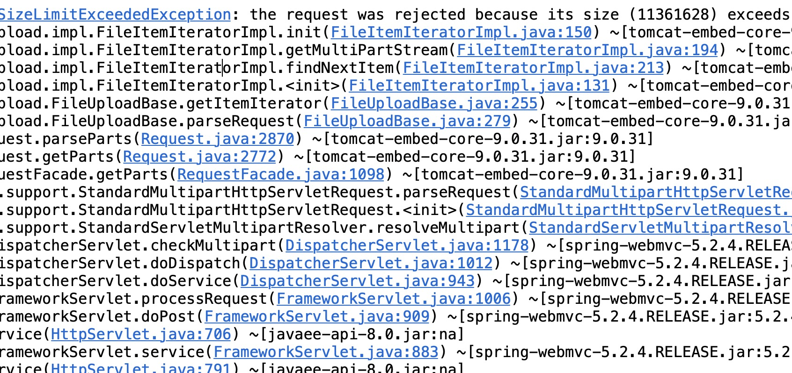

1. chrome command + option + J : 打开浏览器控制台console. 测试页面的时候，要时常打开。尤其是当页面没反应的时候，很可能是你javascript写错了。


2. enctype="multipart/form-data" 
```html
<input type="file" name="file"/>
```

3.文件不能超过1M也不能太大是吧

1048576 / 1024  = 1024 kb

也就是说 不能超过1M

4. avatar avatar avatar avatar avatar 手敲5遍。

5. 浏览器控制台报了个"404"的错，最后发现是我的提交路径写错了
```html
        <script type="text/javascript">
            $("#btn-change-avatar").click(function() {
                $.ajax({
                    "url":"/users/avatar/change",
                    "data":new FormData($("#form-upload")[0]),
                    "contentType":false,
                    "processData":false,
                    "type":"post",
                    "dataType":"json",
                    "success":function(json) {
                        if (jsonn.state == 2000) {
                            alert("修改成功！")
                        } else {
                            alert(json.message);
                        }
                    },
                    "error": function() {
                        alert("您的登录信息已过期！请重新登录");
                    }
                })
            })
        </script>
```

上面的`url`应该是`/users/avatar/change`，我写成了`/user/avatar/change`所以会报`404`的错误。


6. 业务组件要记得用`@Service`标记。


7. 自己没有理解泛型，而是写了一个属性`private String avatar`以及对应的构造方法，以期返回给前端页面`avatar`
但实际上avatar也是一种数据，装配到`JsonResult`中的`T data`即可。
```java
@PostMapping("avatar/change")
public JsonResult<String> changeAvatar(MultipartFile file, User user, 
    String avatar = "/"+ dirName +"/"+child;
    // ....
    return new JsonResult<String>(SUCCESS, avatar);
}
```

8. __AddressMapper.xml__中是根据`@Param()`里的字符串作为参数名的。
比如下面代码：
```java
    Integer updateNonDefaultByUid (
            @Param("aid") Integer uid,
            @Param("modifiedUser") String modifiedUser,
            @Param("modifiedTime") Date modifiedTime
    );
```
配置文件收到的是`aid`, 而不是`uid`。在Mapper类中，把` @Param("aid")`改成` @Param("uid")`即可。


