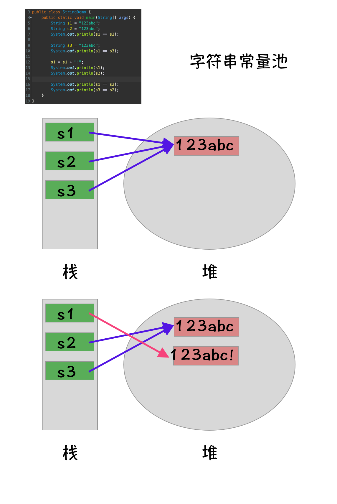

# API　
什么是ＡPI?

Application Programming Interface, 应用程序编程接口。
就是一些已经写好，可供直接调用的功能。
在Java语言中，这些功能以类的形式封装。

JDK API 包含的类库功能强大，经常使用的有：
- 字符串操作
- 容器类
- IO流
- 网络通信
- 多线程


# JDK 包结构

为了便于使用和维护，JDK类库按照包结构划分，不同功能的类划分在不同的包中。

经常使用的包如下表所示：
|包名|功能|
|:-|:-:|
|java.lang|Java程序的基础类，如字符串、多线程等，该包中的类使用的频率非常高，不需要import就可以直接使用|
|java.util|常用工具类，如集合、随机数生成器、日历、时钟等|
|java.io| 文件操作、输入/输出操作|
|java.net|网络操作|
|java.math|数学运算相关操作|
|java.security|安全性相关操作|
|java.sql|数据库库访问|
|java.text|处理文字、日期、数字、信息的格式|


# 文档注释规范

## 文档注释
- 以`/**`开始，以`*/`结束；
- 加在类和方法的开头，用来说明类、方法、变量的作用。
- 通过javadoc工具，可以轻松地将Java文档注释转换为HTML文档说明；学习者和程序员主要通过文档了解API的功能；
- 文档注释不同于普通注释：普通注释用于程序员进行代码维护和交流。文档注释用于生成API的文档说明。


## 文档注释的规范
```java

```

# 字符串

## 字符串是不可变对象
```java

public final class String
    implements java.io.Serializable, Comparable<String>, CharSequence {
    /** The value is used for character storage. */
    private final char value[];

```
- 字符串类型被final修饰，不可以被继承
- 字符串内部封装了一个不可变的字符数组
- 字符串中的char存储的是二进制Unicode编码，长度是16位，即为两个字节。

ACSII / GBK 

GBK:一个汉字劈成左右两半。


## String常量池
- Java 为了提高性能，静态字符串（字面量、常量、常量拼接的结果）都在常量池中创建，并尽量使用同一个对象，重用静态字符串。
- 使用字符串字面量，创建字符串对象时，JVM会首先在常量池中查找，如果存在就从常量池中返回对象。不存在才会创建一个新的字符串对象。
字符串常量池-示例代码：
```java
public class StringDemo {
    public static void main(String[] args) {
        String s1 = "123abc";
        String s2 = "123abc";
        System.out.println(s1 == s2); // true
        
        String s3 = "123abc";
        System.out.println(s1 == s3); // true
        
        s1 = s1 + "!";                // 123abc!
        System.out.println(s1);       // 123abc
        System.out.println(s2);       // 123abc!
        
        System.out.println(s1 == s2); // false
        System.out.println(s3 == s2); // true
    }
}
```


## 内存编码及长度
- String在内存中采用Unicode编码，每个字符占两个字节。


## 使用`indexOf()`实现检索
- indexOf方法：在字符串中检索另一个字符串。、
- String提供了几个重载的`indexOf`方法。
|方法|作用|
|:-|:-|
|int indexOf(String str)|在字符串中检索str, 返回第一次出现的位置，如果找不到则返回-1|
|int indexOf(String str, int fromIndex)|从指定位置开始检索str|
- String还`lastIndexOf()`方法，是从后往前检索字符串的
|方法|作用|
|:-|:-|
|int lastIndexOf(String str)|str在字符串中多次出现时，返回最后一次出现的位置|

示例代码：


## 使用`substring()`获取子字符串

- `subString()`方法用于返回一个字符串的子字符串。
- 如下：

|方法|作用|
|:-|:-|
|`String substring(int beginIndex, int endIndex)`|返回字符串从beginIndex到endIndex的子字符串。含前不含后|
|`String substring(int beginIndex)`|从指定的开始位置一直截取到最后|

示例代码:

## `trim()`去掉一个字符串的前导和后继空字符

示例代码


# String Builder 

# String Buffer

