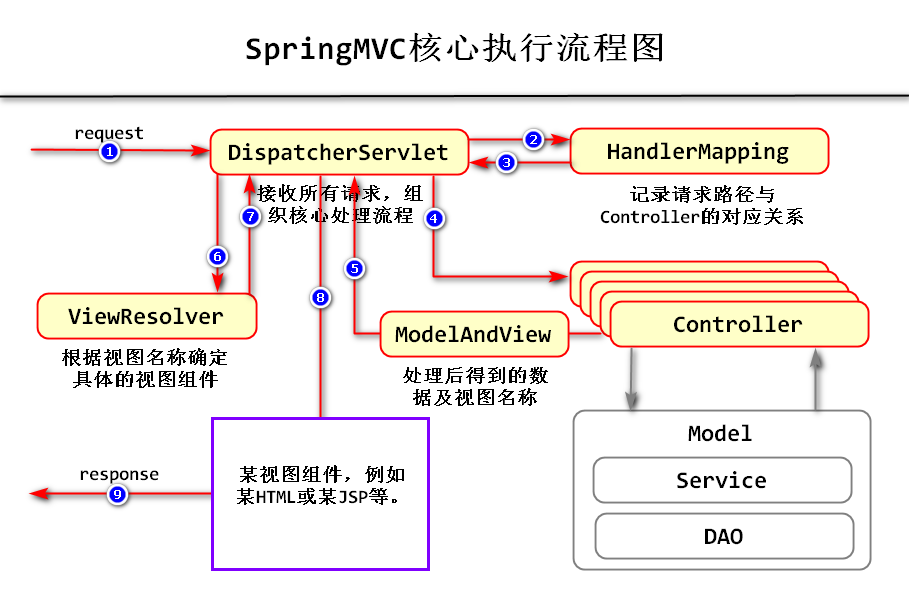

# 1.SpringMVC的主要作用

MVC = Model（数据模型） + View（视图） + Controller（控制器）

SpringMVC框架主要解决了VC之间的交互问题！在SpringMVC框架中，并不关心M的问题！

在传统的Java EE开发模式下，是使用Servlet组件作为项目的控制器，假设项目中有“用户注册”的功能，则可能需要创建`UserRegServlet`，如果还有“用户登录”功能，则可能需要创建`UserLoginServlet`，以此类推，每增加1个新的功能，就需要开发一个新的Servlet，如果某个项目中有100个功能，就需要开发100个Servlet，如果有500个功能，就需要开发500个Servlet！而且，每个Servlet可能还需要添加相关的配置，所以，一旦Servlet的数量过多，就会不利于管理和维护，并且，在服务器运行时，需要创建很多Servlet类的对象，会消耗较多的内存空间。

另外，Java EE的许多API并不简洁，在使用时并不是那么方便！

使用SpringMVC框架，以上问题都可以被解决！

# 2.SpringMVC的核心组件
- `DispatcherServlet`: 前端控制器, 主要负责接收所有请求，并分发到各个具体的`Controller`组件，该类是SpringMVC框架自带的；
- `HandlerMapping`: 用于记录路径与处理请求的`Controller`的对应关系，这是一个接口，在SpringMVC框架中，该接口及实现类都是框架自带的；
- `Controller`: 控制器，具体处理请求的组件，是开发人员自行创建的；
- `ModelAndView`: 控制器的处理结果，包括了处理得到的数据及视图的名称，即：哪些数据应该由那个名称对应的视图来显示，
- 这个`ModelAndView`是一个普通的类，当需要时，可以自行创建对象并向对象中
- ViewResolver：视图解析器，可根据视图名称确定需要使用的视图组件。
01.png

# 3.SpringMVC - HelloWorld
## 3.1 案例目标
开发完成后，启动项目，打开浏览器，输入`http://localhost:8080/项目名称/hello.do`

